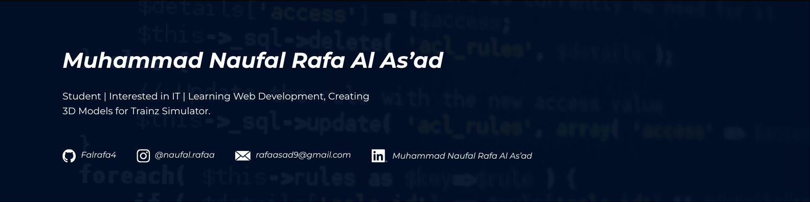

# Hi There! I'm Muhammad Naufal Rafa Al As'ad 👋  
*— A student passionate about web development.*
- 🔭 Currently studying at SMK Telkom Sidoarjo  
- 🌱 I’m currently learning [Laravel Framework](https://laravel.com) and [TailwindCSS](https://tailwindcss.com)
- 🌍 Always open to collaboration, learning, and new opportunities.
---
### 🌐 Socials:
      

### 💻 Tech Stack:
             
### 📊 GitHub Stats:
 
 

### 🏆 GitHub Trophies

### 🔝 Top Contributed Repo

---

<!-- Proudly created with GPRM ( https://gprm.itsvg.in ) -->
